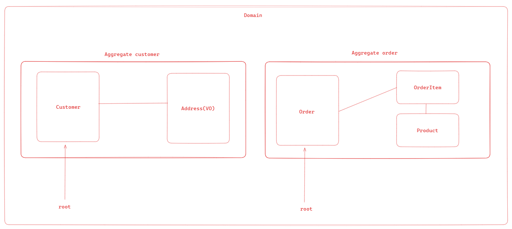
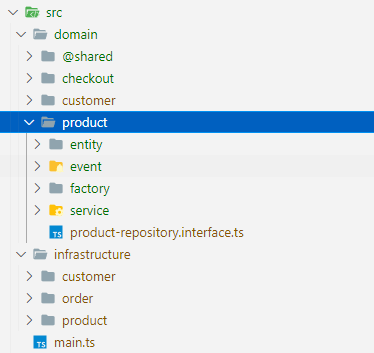

### Domain Driven Design

O Domain-Driven Design, também conhecido pela sigla DDD, fornece uma estrutura para tomada de decisões, combinando práticas de design e desenvolvimento de software.

Centrada na lógica de negócios, ou domínio, sua ideia básica propõe, por meio de uma coleção de padrões e princípios de design, auxiliar todo o ciclo do desenvolvimento,para construir aplicações que reflitam o real entendimento dos processos e regras do negócio.

O DDD está além da forma de pensar, desenhar e desenvolver o software, mesmo não sendo um padrão arquitetural, afeta em como as decisões de construir um software são tomadas.

### Conceitos

Ubiquitous Language: é uma linguagem comum que é usada por todos os membros da equipe de desenvolvimento e pelos stakeholders do projeto. Ele é usado para descrever o domínio do problema e é essencial para garantir que todos tenham um entendimento comum do domínio.

Value Objects (VO): são objetos que representam um valor. Eles são imutáveis e são comparados com base em seus valores. Por exemplo, um valor de dinheiro pode ser representado por um objeto de valor.

Screaming Architecture: é uma arquitetura de software que reflete a estrutura do domínio do problema. Ele é projetado para ser fácil de entender e manter, e é baseado em conceitos de DDD.

Entities: são objetos que têm uma identidade. Eles são comparados com base em sua identidade. Por exemplo, um usuário pode ser uma entidade.

Bounded Contexts: são limites explícitos dentro dos quais um modelo de domínio é definido. Eles são úteis para dividir um modelo de domínio grande em partes menores e mais gerenciáveis.

Services são classes que contêm a lógica de negócios que não se encaixam em nenhuma entidade específica. Eles são responsáveis por orquestrar a lógica de negócios entre várias entidades.

Repositories: são classes que abstraem o acesso a dados. Eles são responsáveis por recuperar e armazenar entidades. Por exemplo um repositório de usuários seria responsável por recuperar e armazenar usuários.

Domain Events: são eventos que ocorrem no domínio. Eles são úteis para desacoplar a lógica de negócios de outras partes do sistema. Por exemplo, um evento de usuário registrado pode ser disparado quando um usuário é registrado.

Módulos: são agrupamentos de entidades, objetos de valor, serviços e repositórios relacionados. Eles são úteis para organizar o código em torno de conceitos de negócios. Busca ordanizar por domínio/subdomínio e não pelo tipo de objeto.

Factories (dica): são classes que são responsáveis por criar objetos complexos. Eles são úteis para encapsular a lógica de criação de objetos complexos.

Para testar a aplicação

`npm install`

`npm test`
