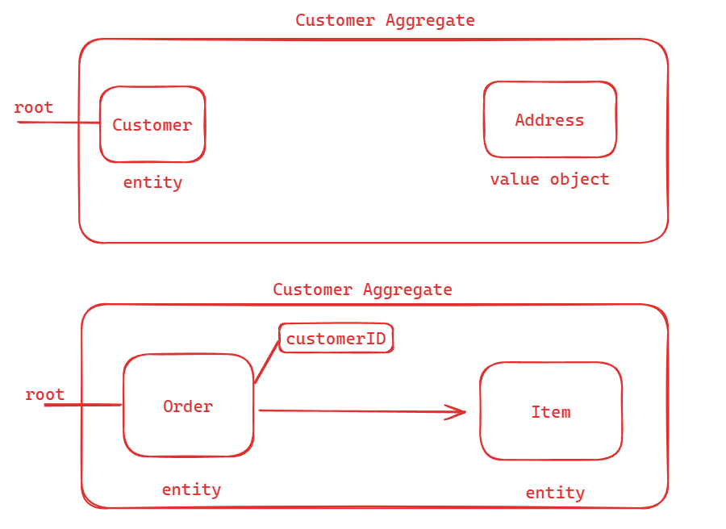

### Domain Driven Design

O Domain-Driven Design, também conhecido pela sigla DDD, fornece uma estrutura para tomada de decisões, combinando práticas de design e desenvolvimento de software.

Centrada na lógica de negócios, ou domínio, sua ideia básica propõe, por meio de uma coleção de padrões e princípios de design, auxiliar todo o ciclo do desenvolvimento,para construir aplicações que reflitam o real entendimento dos processos e regras do negócio.

O DDD está além da forma de pensar, desenhar e desenvolver o software, mesmo não sendo um padrão arquitetural, afeta em como as decisões de construir um software são tomadas.

